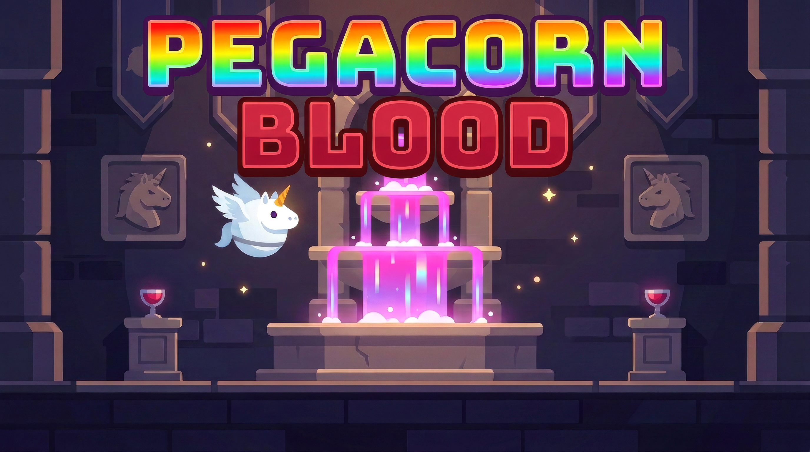

# PEGACORN BLOOD



Your blood belongs in a pegacorn, not a dungeon's chalices. Take it back.

A tiny browser dungeon crawler with pinball momentum: fling your winged unicorn through twisting halls, ram enemies, smash treasure chests, and dodge volleys of ooze. Reclaim every blood chalice and survive any active battle to win.

## Features

- **3 enemy types:** small grubs spit single shots, winged orbs fire three-shot spreads, and large orbs unleash eight-way volleys.
- **A fresh dungeon every run:** seeded generation connects scattered rooms with maze-like corridors, treasure, and gated combat arenas.
- **5 permanent upgrades:** Battle Armor adds health, Valkyrie Wings boosts launch power, Mithril Horn increases damage, Chromatic Hoof chains lightning, and Oracle Eyes reveals the minimap.
- **Loot worth crashing into:** break chests for upgrades, health potions, and stackable bubble shields that each absorb one hit.
- **Procedural presentation:** canvas-drawn characters, rainbow effects, synthesized sound effects, and a looping dungeon theme, built toward the JS13k **13,312-byte** limit.

## Controls

- **Click or tap** the title screen to start.
- **Press and drag anywhere** to aim in the direction of your drag, then **release** to launch. Longer drags give stronger boosts.
- **Ram enemies and chests at speed.** Use wall rebounds to keep moving and steer clear of incoming shots.

Mouse and touch use the same controls; no keyboard required.

## Development

Use Node.js 24 and have `zip` available on your PATH.

```sh
nvm use
npm install
npm run dev
```

Open **http://127.0.0.1:8000**. The watcher rebuilds when source files change; refresh the browser to see updates. Use `npm run dev:minify` to watch with minification, or `npm test` to run the tests.

## Production build

```sh
npm run build
```

Bundles with esbuild, minifies with Terser, and packs with Roadroller. Outputs a self-contained `index.html` and `build.zip`, then prints the ZIP size against the **13,312-byte** target.
